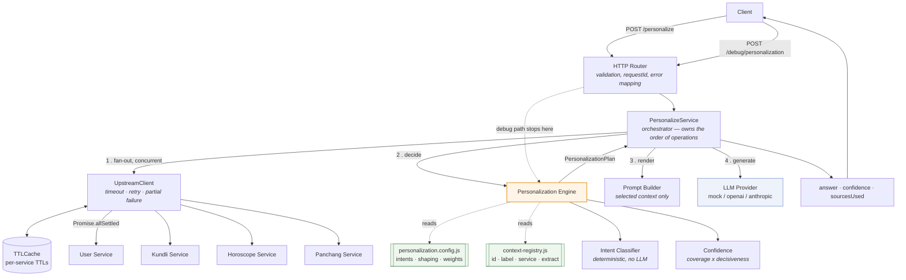

# Architecture


*(Rendered: `docs/architecture.png` · vector: `docs/architecture.svg`. The
Mermaid source below is the same diagram, kept in-repo so it stays reviewable
in a diff.)*

## Request flow



## The same flow in plain text

```
POST /personalize {userId, question}
        |
        v
  [ Router ]  validate -> requestId -> route
        |
        v
  [ PersonalizeService.plan() ]                     <-- shared by BOTH endpoints
        |
        |-- 1. UpstreamClient.fetchAll(userId)
        |      |  concurrent (Promise.allSettled), per-attempt timeout,
        |      |  bounded retries w/ jittered backoff, TTL cache in front
        |      +--> { services, failed[], timings, cacheHits }
        |
        |-- 2. buildPlan(question, services)
        |      |  classify()  -> intent  (deterministic, keyword+stem scoring)
        |      |  config      -> primary / secondary / exclude context ids
        |      |  registry    -> resolve ids against payloads; note what's missing
        |      |  shaping     -> language, tone, maxWords from the user profile
        |      |  confidence  -> coverage of PRIMARY context x intent decisiveness
        |      +--> PersonalizationPlan
        |
        +==== POST /debug/personalization RETURNS HERE (llmInvoked: false) ====
        |
        |-- 3. buildPrompt(plan)     only selected context is rendered
        |
        +-- 4. provider.generate()   mock | openai | anthropic
                |
                v
        { answer, confidence, sourcesUsed, meta }
```

## Why the debug endpoint branches off mid-pipeline

`/debug/personalization` is not a parallel re-implementation of the decision
logic — it is the *same* `plan()` call, stopped one step early. If it were
computed separately the two could disagree, and a debug view that disagrees with
production is worse than none. `test/api.test.js` asserts they agree.

This is also why intent classification is deterministic rather than an LLM call:
the brief requires the debug endpoint to report the intent *without* invoking the
model, which is only possible if intent is decided before the model is involved.

## Module boundaries

| Module | Responsibility | Depends on |
|---|---|---|
| `http/router.js` | Method+path routing, JSON body limits, error→status mapping, request ids | — |
| `server.js` | Composition root. Builds the object graph, validates config at boot | everything |
| `core/personalize-service.js` | Order of operations; the only place that knows the pipeline | upstream, engine, prompt, llm |
| `core/personalization-engine.js` | Decides intent, context, shaping, confidence | config, registry, classifier |
| `core/intent-classifier.js` | Question → intent, deterministically | config |
| `core/confidence.js` | Coverage + decisiveness → HIGH/MEDIUM/LOW | — |
| `core/prompt-builder.js` | Plan → the exact strings sent to the model | — |
| `services/upstream-client.js` | Concurrency, timeouts, retries, partial failure, caching | cache |
| `llm/*` | One `generate()` method per provider | — |
| `config/*` | Product decisions as data | — |

The dependency arrows point one way: `config` and `lib` know nothing about
`core`, and `core` knows nothing about HTTP. That is what makes the engine
testable without a server and the classifier testable without a network.

## Extending it

**A new intent (say `education`)** — add one entry to `INTENTS` in
`personalization.config.js` with its match terms and its primary/secondary/
exclude context ids. No engine code changes. `GET /config` will show it
immediately and `validateConfig()` at boot rejects typos in the ids.

**A new context source (say a Saturn transit service)** — add an entry to
`CONTEXT_REGISTRY` (id, label, service, `extract`, `render`), add the fetch to
`UpstreamClient.fetchAll`, then reference the id from whichever intents want it.

**A new LLM provider** — implement `generate({system, user, maxWords})` and add a
case to `createProvider`. Nothing else in the codebase sees a provider type.
