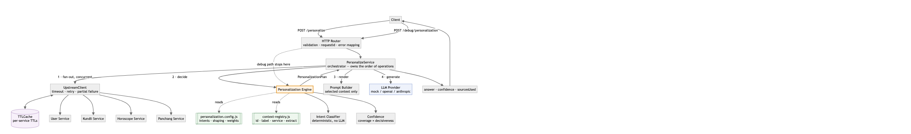

# MyNaksh — Personalized AI Context Engine

The intelligence layer between MyNaksh's structured backend services and the LLM.
It decides *what a given user's question actually needs to know*, fetches only
that, shapes the response to the user, and returns a grounded answer with the
sources it used.

**Zero runtime dependencies.** Node's standard library only — clone and run.



---

## Run it

```bash
node --version     # needs >= 20 (developed on 23.11)
npm start          # starts mock upstreams (:4001) and the app (:3000)
```

That is the whole setup. No `npm install`, no API key, no Docker.

In a second terminal:

```bash
npm run demo       # walks all the brief's sample questions through both endpoints
npm test           # 48 tests
```

### Try it by hand

```bash
curl -s localhost:3000/personalize -H 'content-type: application/json' \
  -d '{"userId":"user_101","question":"Should I consider changing my job in the next few months?"}'
```

```json
{
  "answer": "...",
  "confidence": "HIGH",
  "sourcesUsed": ["10th House", "Career Horoscope", "Current Dasha", "Today's Panchang"]
}
```

The decision behind that answer, without spending a token:

```bash
curl -s localhost:3000/debug/personalization -H 'content-type: application/json' \
  -d '{"userId":"user_101","question":"Should I consider changing my job in the next few months?"}'
```

```json
{
  "intent": "career",
  "selectedContext": ["10th House", "Career Horoscope", "Current Dasha", "Today's Panchang"],
  "excludedContext": ["Relationship Horoscope"],
  "confidence": "HIGH",
  "coverage": 1,
  "llmInvoked": false
}
```

### See it degrade

```bash
UPSTREAM_FAIL_SERVICE=kundli npm start
```

The same career question now loses the 10th House and Current Dasha, `coverage`
drops to `0.5`, `confidence` falls to `MEDIUM`, and the answer still ships from
the context that survived.

### Endpoints

| Method | Path | Purpose |
|---|---|---|
| POST | `/personalize` | Full pipeline. `{answer, confidence, sourcesUsed, meta}` |
| POST | `/debug/personalization` | The plan only. Never calls the LLM. |
| GET | `/health` | Liveness + active provider |
| GET | `/config` | Live intent/context configuration + cache stats |

### Using a real model

```bash
LLM_PROVIDER=openai OPENAI_API_KEY=sk-... npm start
# or
LLM_PROVIDER=anthropic ANTHROPIC_API_KEY=sk-ant-... npm start
```

Mock is the default so the project is reviewable with no credentials. The mock
is not a canned string — it composes its reply from the context it was actually
handed, so you can see selection working without paying for a completion.

See `.env.example` for every knob. Architecture and extension points:
[`ARCHITECTURE.md`](./ARCHITECTURE.md).

---

## The three decisions that shaped this

### 1. Intent classification is deterministic, not an LLM call

The brief requires `/debug/personalization` to report the interpreted intent
while explicitly **not** invoking the LLM. If classification were itself a model
call, that endpoint could not answer honestly — it would have to either lie or
call the model anyway.

So intent is decided by weighted keyword/phrase scoring with a light suffix
stemmer, before the model is involved. That buys three things: the debug
endpoint is truthful, free and instant; the whole selection path is unit-testable
with no network; and routing is *stable* — the same question always routes the
same way, which is what you want at 2 a.m. when an answer looks wrong.

The cost is recall on phrasings nobody anticipated, and it is English-only. Two
mitigations: `general` is a **widening** fallback rather than a refusal, so an
unrecognised question still gets answered with everything available; and the
classifier reports its own score, so `confidence` can reflect a weak match
instead of hiding it.

A real deployment would likely run this as a fast first pass and escalate only
low-scoring questions to a small classifier model — see "another day" below.

*Terms are split into `strong` and `any` tiers.* `invest`, `marriage`,
`promotion` are decisive alone; `work`, `focus`, `energy` are shared across life
areas and need corroboration. That split is what lets the threshold stay high
enough to reject incidental vocabulary while one decisive word still routes
correctly. It came out of a real failure: the brief's own example question
("changing my job") originally fell through to `general`.

### 2. `confidence` means "how well-grounded is this answer", and nothing else

The brief requires the field but never defines it, so here is the definition:

```
coverage = (primary context items resolved) / (primary context items required)

HIGH    coverage == 1 AND intent classification had a clear winner
MEDIUM  coverage >= 0.5, or intent was ambiguous
LOW     coverage < 0.5, or no context at all
```

Deliberately **not** the model's self-reported certainty — models are poorly
calibrated about their own confidence — and **not** a claim about astrological
truth, which is not something software can assert.

Both inputs are known before the LLM runs, which is exactly why the debug
endpoint can report the real confidence without a completion.

### 3. Exclusion is a first-class decision, not an absence

`excludedContext` is not "stuff we happened not to fetch". It is an explicit
statement that this context would make the answer *worse* — relationship
guidance bleeding into a career answer — and it is surfaced in the debug
endpoint so the decision is auditable. The data is fetched and then deliberately
withheld; `test/prompt-builder.test.js` asserts it never reaches the model.

---

## Assumptions

1. **The four upstream services exist and are HTTP/JSON.** Mocked here on
   `:4001`, in a separate process so the concurrency, timeout and retry paths
   exercise real sockets rather than resolved promises.
2. **Panchang is global for a day**, not per user. This drives a single shared
   cache key and is the largest single saving in the system — one fetch serves
   every user.
3. **Kundli is effectively immutable** (derived from fixed birth details), so it
   carries the longest TTL.
4. **`userId` is trusted.** There is no auth; in production this endpoint sits
   behind the existing gateway and `userId` comes from the session, not the body.
5. **`sourcesUsed` should carry human labels** ("Career Horoscope"), matching the
   brief's example, while config uses stable ids (`career_horoscope`). Both live
   on one row in the registry so they cannot drift.
6. **A partial answer beats no answer.** If Panchang is down, a career question
   never needed it; failing the whole request would be the worse product.
7. **Astrological interpretation is the model's job, not this layer's.** The
   engine selects and grounds; it does not reason about placements.

## Trade-offs

| Decision | Why | What it costs |
|---|---|---|
| Zero dependencies, `node:http` not Express | Runs on a reviewer's machine with no install; nothing to audit; the layering is visible rather than hidden behind middleware | ~60 lines of routing written by hand; no ecosystem middleware |
| Deterministic classifier | Debug endpoint stays honest; testable; stable routing | Misses unanticipated phrasings; English-only |
| Config-as-JS-module, not YAML/JSON file | Comments live next to the rules, and `validateConfig()` catches typos at boot | Config changes need a restart; not editable by non-engineers |
| Mock provider by default | Reviewable with no credentials; usable as a test oracle | Default output is not a real completion |
| Separate mock upstream process | Real HTTP exercises retries/timeouts/partial failure | Two processes to start (hidden behind `npm start`) |
| In-memory cache with single-flight | No infrastructure; correct for a single instance; concurrent cold reads coalesce to one upstream call | Does not survive restart; not shared across instances |
| Confidence computed pre-LLM | Debug endpoint can report it truthfully; cheap | Ignores signal the model itself might give about the answer |

## What I intentionally simplified

- **No auth, no rate limiting, no quotas.** Assumed to be the gateway's job.
- **No persistence.** No conversation history, no storage of questions or
  answers. Each request is standalone; a real product would want threading.
- **Cache is an unbounded `Map`.** Correct for a demo with two users; it needs a
  bound before it meets real traffic (see below).
- **Retry policy is one global setting**, not per-service. Panchang and Kundli
  have very different cost profiles and would justify different budgets.
- **The mock provider does not paraphrase.** It renders the selected context
  rather than inventing astrological judgement, because a mock that invents
  predictions makes the system look better than it is.
- **No streaming.** The brief's contract is a single JSON body; token streaming
  would change the response shape.
- **Language personalization is an instruction to the model**, not translation.
  A Hindi user gets a Hindi instruction; correctness depends on the model.

## What I would improve with another day

1. **Hybrid intent classification.** Keep the deterministic pass as the fast
   path, and escalate only questions scoring below threshold to a small
   classification model — with the LLM-derived intent cached against a
   normalised question hash so `/debug` stays cheap and truthful for repeats.
2. **Bound the cache** with an LRU and a max entry count. Single-flight is
   already implemented — 30 concurrent cold requests coalesce to 4 upstream
   calls rather than 120 — but nothing caps how many distinct keys are held.
3. **Per-service resilience policy** — individual timeouts, retry budgets and a
   circuit breaker, so a persistently failing Kundli stops being retried on
   every request instead of adding latency to answers that will degrade anyway.
4. **A prompt-size budget with graceful truncation.** `general` currently sends
   all 11 context items; at real scale that wants a token budget that drops
   secondary context first (the plan already orders primary before secondary
   for exactly this reason).
5. **Golden-file tests over prompts**, so a change to context selection shows up
   as a reviewable prompt diff rather than a silently different answer.
6. **Structured evals.** A fixture set of questions with expected intent and
   expected sources, run in CI — the only way to change classifier weights
   without regressing routing.
7. **Real observability** — OpenTelemetry spans across the fan-out, and metrics
   for cache hit rate, per-intent confidence distribution, and degraded-answer
   rate. Degraded-answer rate is the number I would actually alert on.

## Production concerns deliberately left out

- **Authentication, authorization, tenancy.** No identity verification at all.
- **Rate limiting and cost control.** Nothing stops a caller burning LLM spend;
  a real deployment needs per-user quotas and a global spend ceiling.
- **PII handling.** Logs are already clean — they carry ids, timings, intents and
  sizes, never payloads, names, birth details or question text (verified by
  grepping a live log). The gap is the **prompt**: birth-derived context leaves
  the network boundary on every request to a third-party model. Production needs
  a data-retention policy and an explicit decision about what may be sent to a
  model provider at all — the current answer is "whatever the config selected".
- **Prompt injection.** The user question is interpolated into the prompt. The
  system message instructs grounding, but there is no input sanitisation or
  output validation. A user asking the model to ignore its instructions is not
  currently defended against.
- **Horizontal scaling.** In-memory cache means N instances do N times the
  upstream fetches; this wants Redis with the same per-namespace TTLs.
- **Graceful shutdown.** No connection draining on SIGTERM.
- **Model output validation.** The answer is returned as-is — no length
  enforcement, no check that it stayed in the requested language, no safety
  screening on guidance that touches health or finance. For an astrology product
  giving health and money guidance at 1M+ MAU, that screening is not optional.
- **Cost/latency budgets per request.** No ceiling on total request time.

## Layout

```
src/
  main.js                        one-command entrypoint (upstream + app)
  server.js                      composition root, route table, boot validation
  config/
    app.config.js                env -> frozen config
    personalization.config.js    INTENTS, response shaping, classifier weights
    context-registry.js          context id -> label, service, extract, render
  core/
    personalize-service.js       orchestrator (the only place that knows the order)
    personalization-engine.js    plan builder: intent -> context -> shaping
    intent-classifier.js         deterministic scoring + stemmer
    confidence.js                coverage x decisiveness -> HIGH/MEDIUM/LOW
    prompt-builder.js            plan -> prompt strings
  services/
    upstream-client.js           concurrency, timeout, retry, partial failure
    mock-upstream-server.js      the four backend services, with fault injection
    fixtures.js                  sample users/kundlis/horoscopes
  llm/
    provider.js                  factory + the one-method interface
    mock-provider.js             default; composes from selected context
    openai-provider.js
    anthropic-provider.js
  lib/
    cache.js                     TTL cache, per-namespace TTLs
    logger.js                    JSON-line structured logging
  http/
    router.js                    routing, body limits, error mapping
test/                            48 tests
```

## Logging

One JSON object per line, correlated by `requestId`:

```json
{"ts":"...","level":"info","msg":"upstream.fanout","requestId":"...","totalMs":110,
 "timings":{"user":55,"horoscope":51,"panchang":51},"failed":["kundli"],"cacheHits":[]}
{"ts":"...","level":"info","msg":"prompt.built","requestId":"...","intent":"career",
 "promptChars":818,"estimatedTokens":205,"contextItems":4,"maxWords":250}
{"ts":"...","level":"info","msg":"llm.completed","requestId":"...","provider":"mock","llmMs":0}
{"ts":"...","level":"info","msg":"request.completed","requestId":"...","status":200,"latencyMs":118}
```

Request latency, per-service upstream latency, cache hits, prompt size and
failures are all recoverable from the log stream — which is the minimum needed
to answer "why was this answer slow, thin, or wrong".
